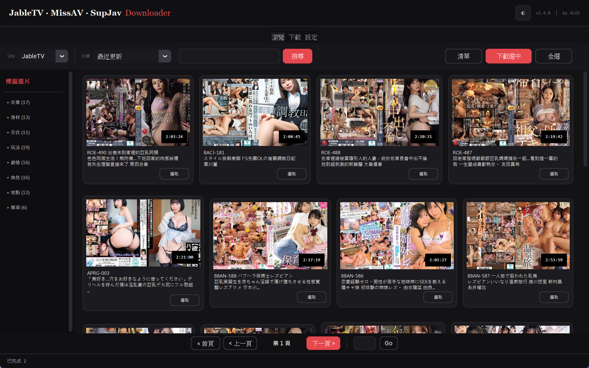
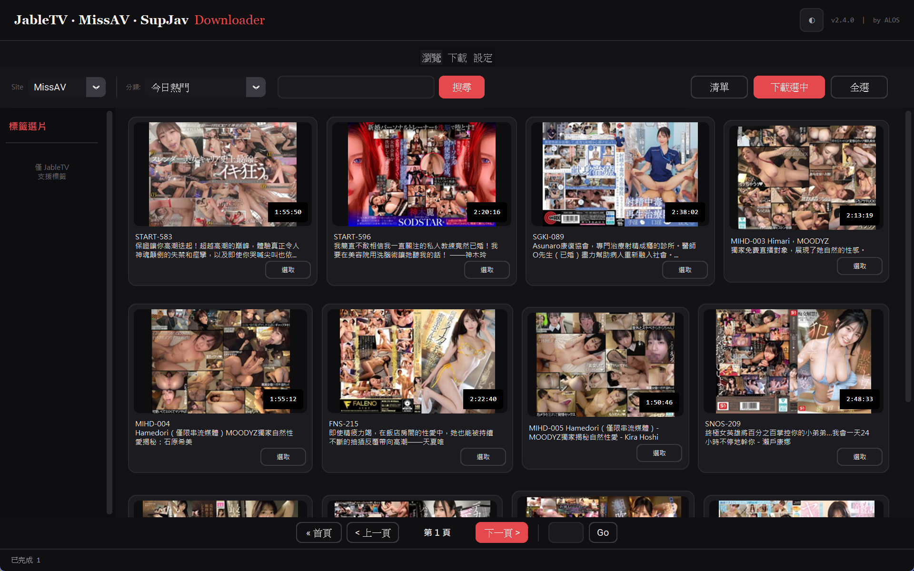
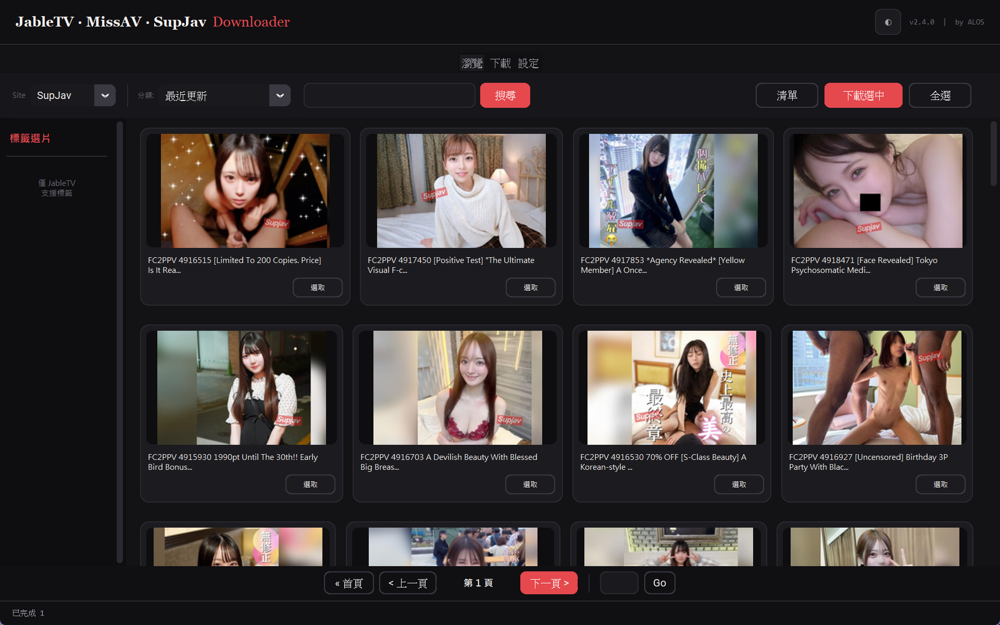
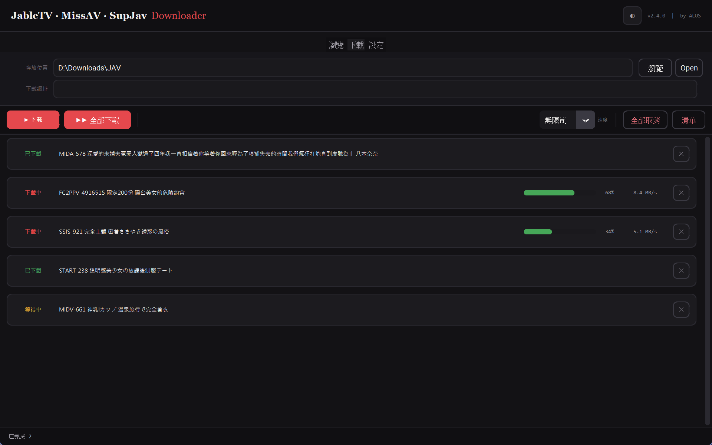
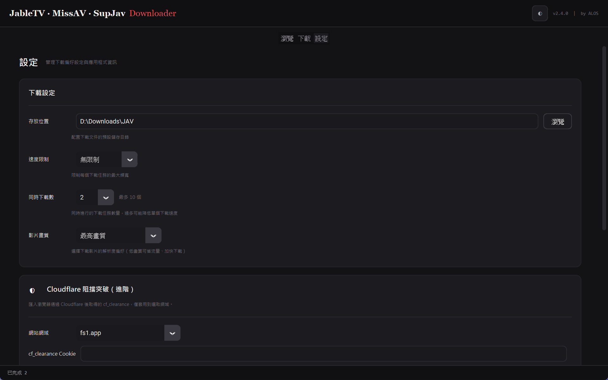

<p align="center">
  
  
  
  <a href="https://github.com/Alos21750/JableTV-MissAV-Downloader-GUI-2026/releases"></a>
</p>

<h1 align="center">JableTV Downloader — GUI Video Downloader for Jable TV & MissAV</h1>
<p align="center"><strong>Jable TV Download Tool ｜ MissAV Download Tool ｜ Free Desktop App</strong></p>
<p align="center"><strong>by ALOS</strong></p>

<p align="center">
  <a href="./README.md">繁體中文</a> ｜ English
</p>

> The best **Jable TV downloader** with a full GUI — no command line needed. Download videos from **Jable TV**, **MissAV**, and **SupJav** with a built-in video browser, keyword search, multi-select batch download, and up to 10 parallel high-speed downloads. Portable Windows `.exe` — just double-click to run, no Python or installation needed. Also supports FC2 videos, Chinese subtitle filtering, actress/category page bulk download, M3U8/HLS streams, and resolution selection.

---

## Why JableTV Downloader?

Most Jable TV download tools are CLI-only — you need Python, pip, and a terminal. **JableTV Downloader is a full GUI desktop app** that anyone can use.

| | JableTV Downloader (this tool) | CLI-only tools |
|--|:---:|:---:|
| GUI interface | **Yes** — browse, search, click to download | No — requires typing commands |
| MissAV support | **Yes** | Usually JableTV only |
| Batch download | **Multi-select + 10 parallel** | Usually one at a time |
| No installation | **Double-click .exe** | Requires Python + pip install |
| Built-in browser | **Yes** — browse thumbnails in-app | No |
| Progress display | **Real-time progress bars** | Terminal text |
| Resolution choice | **Highest / Lowest quality toggle** | Usually highest only |
| Actively maintained | **Yes** | Most are abandoned |

---

## Screenshots (v2.4 redesign · Day / Night themes)

> Brand-new "Studio Noir" design with a built-in **one-click day / night theme toggle** (defaults to following your Windows system theme).

### JableTV Browse (dark)
<p align="center">
  
</p>

### MissAV Browse (dark)
<p align="center">
  
</p>

### SupJav Browse (dark)
<p align="center">
  
</p>

### ☀️ Light theme (one-click toggle)
<p align="center">
  
</p>

### Download Manager (Live Progress Bars)
<p align="center">
  
</p>

### Settings (theme toggle + Cloudflare bypass)
<p align="center">
  
</p>

---

## Two Tools

This project ships two independent executables:

| Tool | Purpose | Target user |
|------|---------|-------------|
| **JableTV_Modern.exe** | Full downloader — browse, search, multi-select, concurrent downloads | Anyone who wants to actively pick videos to download |
| **Jable_smalltool.exe** | Daily auto-downloader for new releases — set the folder once and leave it running | Anyone who wants a set-and-forget feed of the newest releases |

## Features (JableTV_Modern.exe)

- **Native Material Design UI** — Built with CustomTkinter, dark theme, no browser required
- **Built-in Browser** — Browse video categories and search directly within the app, with full pagination
- **Multi-Select Download** — Check multiple videos in the browse panel, send to download queue in one click
- **Parallel Downloads (up to 10)** — Download up to 10 videos concurrently; configurable in Settings (default 2)
- **Resolution Selection** — Choose highest quality (default) or lowest quality (saving mode) in Settings
- **Speed Rate Limiting** — Configurable bandwidth limit (1/2/5/10/15 MB/s or unlimited)
- **Real-Time Progress** — Per-item progress, speed & status (incremental UI updates — no flicker)
- **Smart Clipboard** — Auto-detects video URLs copied to clipboard
- **Import from File** — Batch-import URLs from `.txt` / `.csv` files
- **Open Folder** — One-click to open the download destination folder
- **Auto Merge** — Automatically merges TS segments into a complete MP4 after download
- **Resume Support** — Cancelled downloads can be restarted; completed segments are preserved
- **High DPI Support** — Automatically adapts to high-resolution displays for crisp UI
- **Settings Tab** — Configure download speed, save location, concurrency, and video quality
- **Portable Windows Build** — Pre-packaged `.exe`, no Python installation needed

## Features (Jable_smalltool.exe)

- **Set once, runs daily** — Pick the save folder once and the tool checks for new videos every 24 hours
- **Multi-site support** — Watches both JableTV and MissAV with multi-category selection
- **Focused on Chinese-subtitled** — Filters for Chinese-subtitled releases
- **Deduped by memory** — Already-seen URLs are stored in `.Jable_smalltool/seen.json` so nothing downloads twice
- **Smart baseline date** — Defaults to yesterday, so first-run won't download a huge backlog
- **Check-now button** — Don't want to wait 24 h? Trigger an immediate scan
- **Background friendly** — Minimize to the taskbar and forget

## Supported Sites

| Site | Browse | Search | Download |
|------|:------:|:------:|:--------:|
| [Jable.tv](https://jable.tv) | ✅ | ✅ | ✅ |
| [MissAV](https://missav.ai) | ✅ | ✅ | ✅ |
| [SupJav](https://supjav.com) | ✅ | ✅ | ✅ |
| Other M3U8 sites | — | — | ✅ |

## Quick Start

### Windows Users (Recommended)

Go to **[Releases](../../releases)** and download (each ~58 MB, **ffmpeg bundled — single file, just double-click**):

- **JableTV_Modern.exe** — Full downloader (browse / search / multi-select / parallel)
- **Jable_smalltool.exe** — Daily auto-downloader (set the folder once, leave it running)
- English UI: **JableTV_Modern_en.exe** / **Jable_smalltool_en.exe**

Double-click to run — **no Python and no separate ffmpeg install needed**.

#### 🌏 Faster / mirrored download (when GitHub is slow or blocked)

If the GitHub Release download is slow or fails (e.g. in mainland China), prefix the download URL with a mirror — **these links always point to the latest release**:

| File | Accelerated link |
|---|---|
| JableTV_Modern.exe | **[gh-proxy mirror](https://gh-proxy.com/https://github.com/Alos21750/JableTV-MissAV-Downloader-GUI-2026/releases/latest/download/JableTV_Modern.exe)** |
| Jable_smalltool.exe | **[gh-proxy mirror](https://gh-proxy.com/https://github.com/Alos21750/JableTV-MissAV-Downloader-GUI-2026/releases/latest/download/Jable_smalltool.exe)** |
| JableTV_Modern_en.exe | **[gh-proxy mirror](https://gh-proxy.com/https://github.com/Alos21750/JableTV-MissAV-Downloader-GUI-2026/releases/latest/download/JableTV_Modern_en.exe)** |
| Jable_smalltool_en.exe | **[gh-proxy mirror](https://gh-proxy.com/https://github.com/Alos21750/JableTV-MissAV-Downloader-GUI-2026/releases/latest/download/Jable_smalltool_en.exe)** |

> 💡 If `gh-proxy.com` is down, swap the `https://gh-proxy.com/` prefix for `https://gh-proxy.org/` or `https://ghfast.top/`.

### macOS / Linux / Other Platforms

```bash
# 1. Make sure Python 3.8+ is installed
python --version

# 2. Install dependencies
pip install -r requirements.txt

# 3. Launch the full downloader GUI
python main.py

# 4. Launch the daily auto-downloader
python jable_smalltool.py

# 5. CLI mode (optional)
python main.py -nogui True
```

## Usage

1. **Browse Tab** — Pick a site & category, browse thumbnails with pagination, select videos, click "Download Selected"
2. **Download Tab** — Paste video URLs or import from file, click "Download All"
3. **Queue Management** — Active downloads show progress; pending items auto-start
4. **Settings Tab** — Configure speed limit, save location, video quality
5. **Open Folder** — Click the folder button to view downloaded videos
6. **Cancel / Cancel All** — Stop any or all downloads at any time

## Technical Details

- M3U8 stream protocol parsing & multi-threaded download
- AES-128 encrypted stream auto-decryption
- Automatic TS segment merging to MP4 (no FFmpeg required)
- Token-bucket rate limiter shared across all parallel downloads
- `ThreadPoolExecutor` for parallel download management
- Thread-safe Tkinter queue design for GUI updates
- Per-Monitor DPI V2 support for high-resolution displays

---

## FAQ

**Q: How is this different from other Jable TV download tools?**
A: This is the only Jable TV downloader with a full GUI. No command line, no Python installation needed — just download the `.exe` and run it. It also supports MissAV, which most other tools don't.

**Q: Do I need Python?**
A: No, if you're on Windows. Just download the `.exe` from Releases and double-click. macOS/Linux users need Python 3.8+.

**Q: Does it support MissAV?**
A: Yes. Both JableTV and MissAV are fully supported — browsing, searching, and downloading.

**Q: Can I choose the video quality?**
A: Yes. In Settings, you can switch between highest quality (default) and lowest quality (saving mode for slow connections).

---

## Disclaimer

> **This tool is for educational and technical research purposes only.** Users must comply with local laws and respect content copyrights. The developer assumes no legal responsibility for any consequences arising from the use of this tool. Do not use this tool for any illegal or infringing purposes.

## Credits

Based on [hcjohn463/JableDownload](https://github.com/hcjohn463/JableDownload) and [AlfredoUen/JableTV](https://github.com/AlfredoUen/JableTV).

## Author

**ALOS** — [GitHub](https://github.com/Alos21750)

## Related Keywords

`Jable TV download` `JableTV downloader` `Jable TV downloader GUI` `Jable video download` `MissAV download` `MissAV downloader` `MissAV downloader GUI` `jable.tv batch download` `missav batch download` `M3U8 downloader` `HLS video download` `FC2 download` `Chinese subtitle download` `AV downloader` `video downloader GUI` `jable tv download tool` `missav download tool` `jable downloader free` `missav downloader free` `jable 下載` `missav 下載器` `jable tv 下載器`

## Star History

<a href="https://star-history.com/#Alos21750/JableTV-MissAV-Downloader-GUI-2026&Date">
 <picture>
   <source media="(prefers-color-scheme: dark)" srcset="https://api.star-history.com/svg?repos=Alos21750/JableTV-MissAV-Downloader-GUI-2026&type=Date&theme=dark" />
   <source media="(prefers-color-scheme: light)" srcset="https://api.star-history.com/svg?repos=Alos21750/JableTV-MissAV-Downloader-GUI-2026&type=Date" />
   
 </picture>
</a>

## License

[Apache License 2.0](LICENSE)
